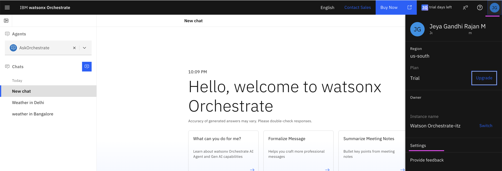
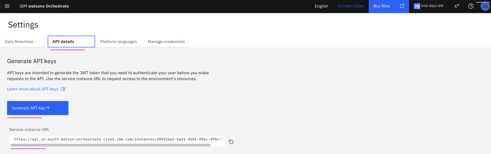
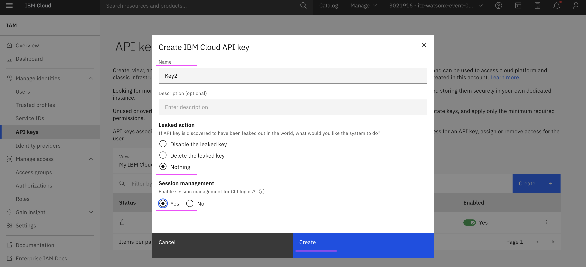

# Setting up the ADK

The detailed info about this is avialable in https://developer.watson-orchestrate.ibm.com/getting_started/installing

## 1. Get Service Instance URL and API Key

1. Click on the User Icon in the top left.

2. Click on **Settings**
  

3. Click on **API Details** tab

4. Copy the **Service instance URL** value

5. Click on **Generate API key→** button
  

6. Enter the required detail

7. Click on **Create→** button
  

8. Click on **Copy** to copy the generated key
  

## 2. Start the ADK

1. Replace the values of the following variables as required
2. Run the below commands.

```
export ENV_NAME=test_mcp1
export SERVICE_INSTANCE_URL=https://api.us-south.watson-orchestrate.cloud.ibm.com/instances/xxxx-ba21-4181-9fec-xxxxxxxxx
export API_KEY=xxxxxxxxx
```

3. Run the following commmands to activate the orchestrate env 

```
orchestrate env add --name $ENV_NAME  --url $SERVICE_INSTANCE_URL 
orchestrate env activate $ENV_NAME  --apikey $API_KEY 
```

You may get the output like the below.
```
[INFO] - Environment 'test_mcp1' is now active
```
