# Deploying and Accessing Local MCP Server toolkit - GPro app

## 1. Set up ADK

The detailed info is available [here](../001-setting-up-adk) 

## 2. Importing local MCP toolkits

1. Goto the [files](./files) folder of this repo 

2. Run the below command.

  ```
  ./deploy_local.sh
  ```

  You might have got the output like this.

  ```
  [ERROR] - This functionality is only available for Local Environments
  [INFO] - Successfully imported tool kit mcp_gpro_local
  ```

## 3. Create Agent and import tool from MCP

1. Click on **Build** >  **Agent Builder**
  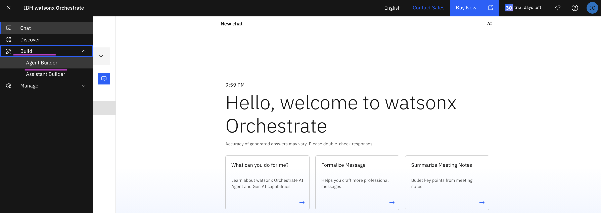

2. Click on **Create Agent**
  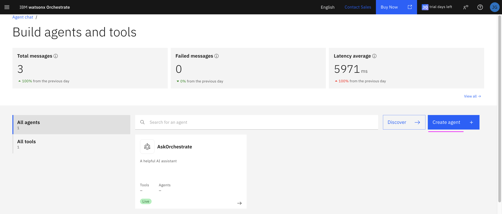

3. Enter the **Name :** 

4. Enter the **Description :** `The MCP Gpro Agent assists with finding weather for the given city using the tool available.`

5. Click on **Create→** button
  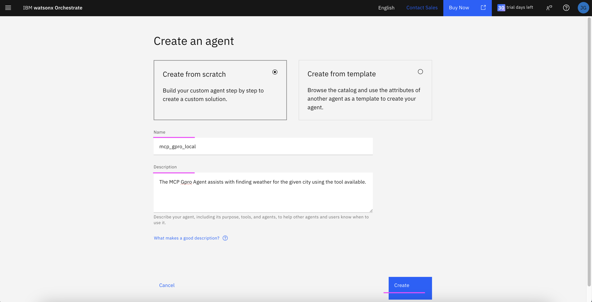

6. Click on **Toolset** menu
  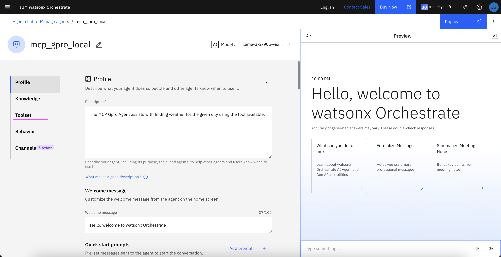
  You can see the tools section is empty.

7. Click on **Add tool** button
  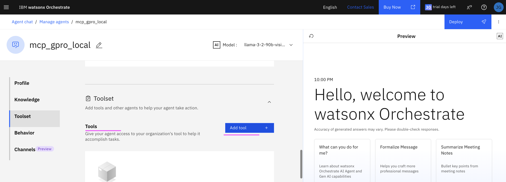

8. Choose **Add from file or MCP server**
  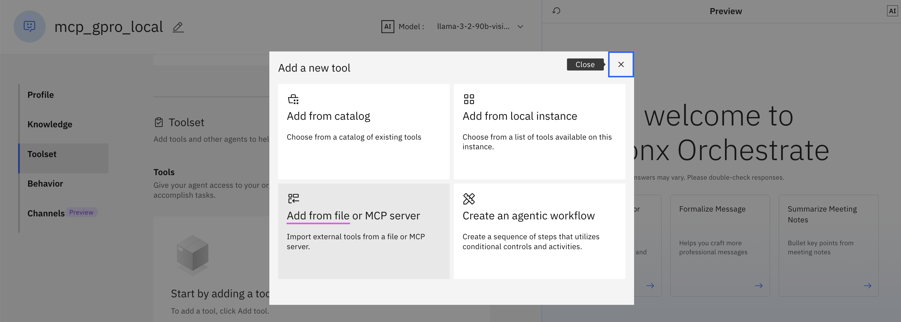

9. Choose **Import from MCP server**
  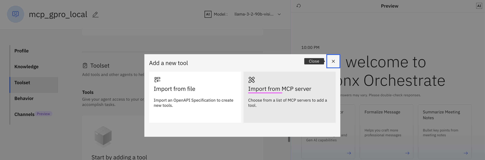

10. Choose **mcp_gpro_local** and click on **Close** icon on the top
  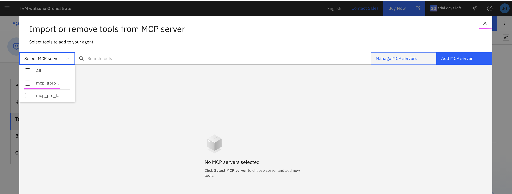

11. Switch on **Activation toggle** for the selected tool **mcp_gpro_local** and click on **Close** icon on the top
  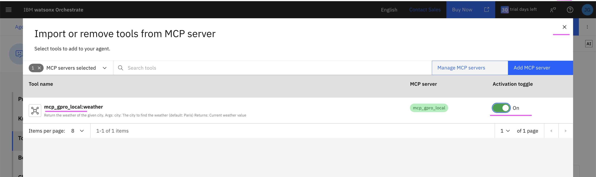

12. In the preview chat window, you can type your question related to weather of a city and get the answers. (Mock weather data only)
  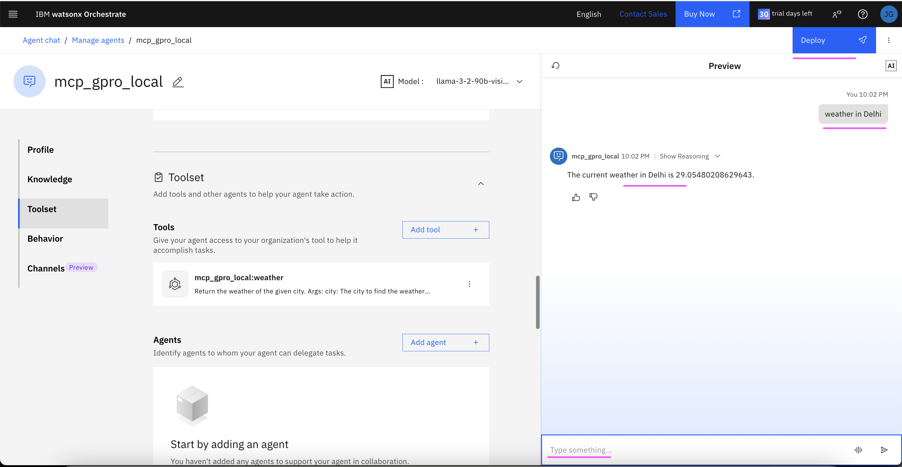

13. Click on **Deploy** button
  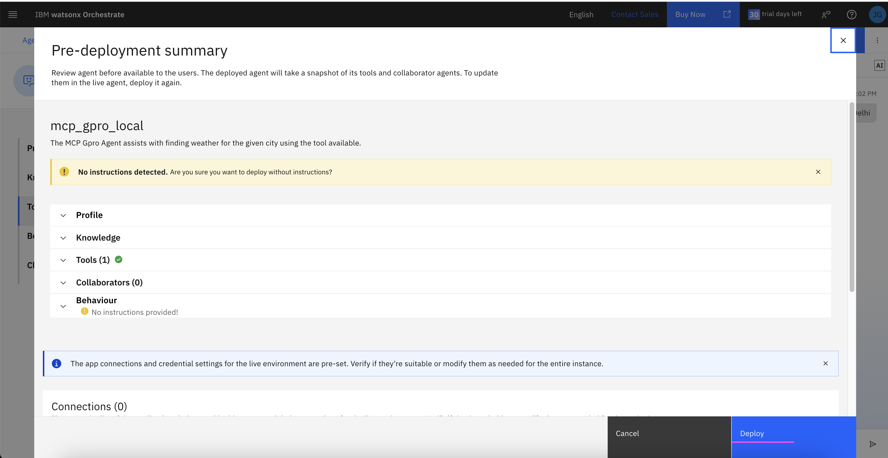

14. Choose the **mcp_gpro_local** agent
  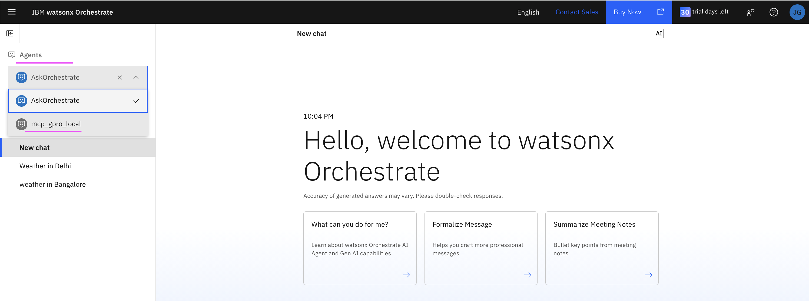

15. In the chat window, you can type your question related to weather of a city and get the answers. (Mock weather data only)
  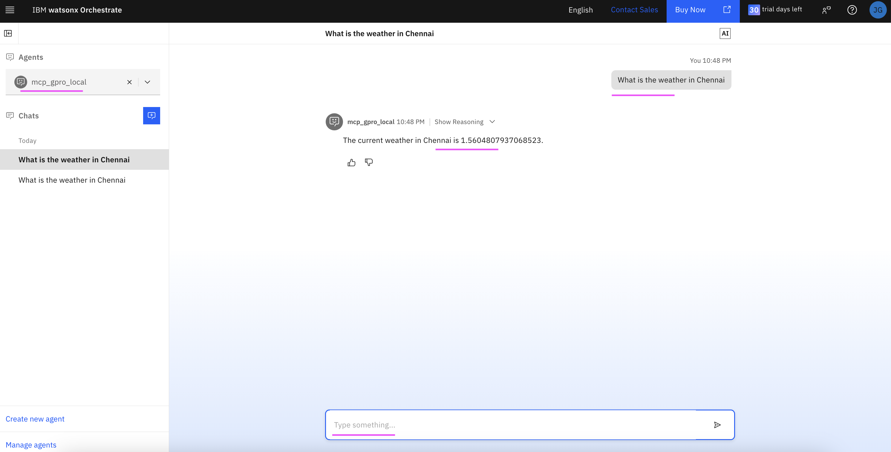
