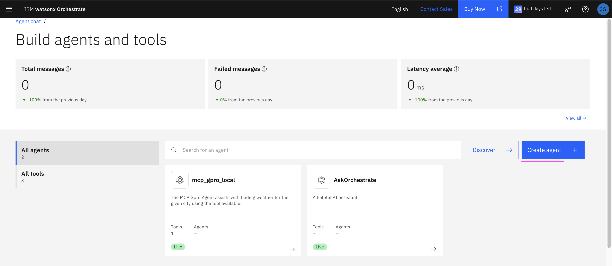
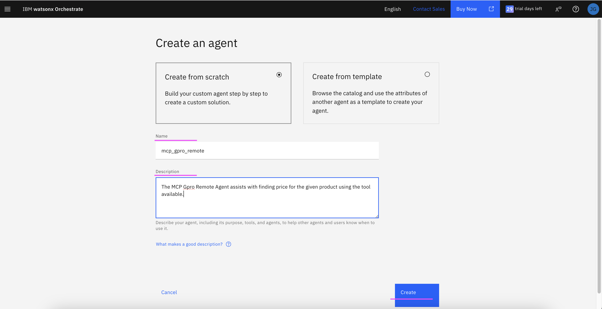
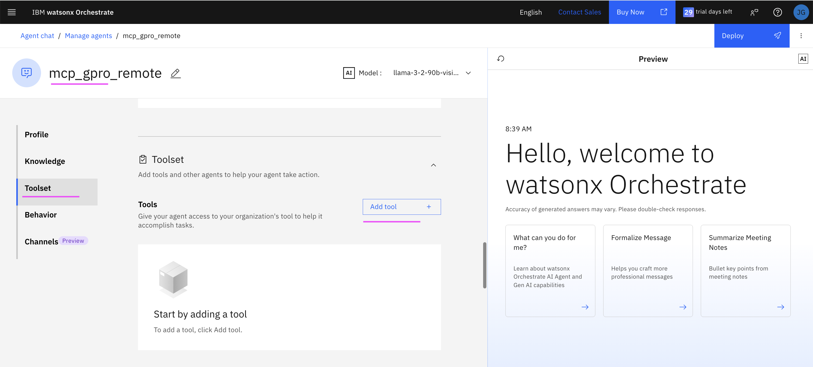
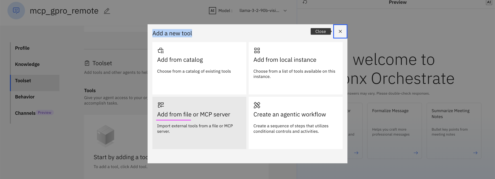
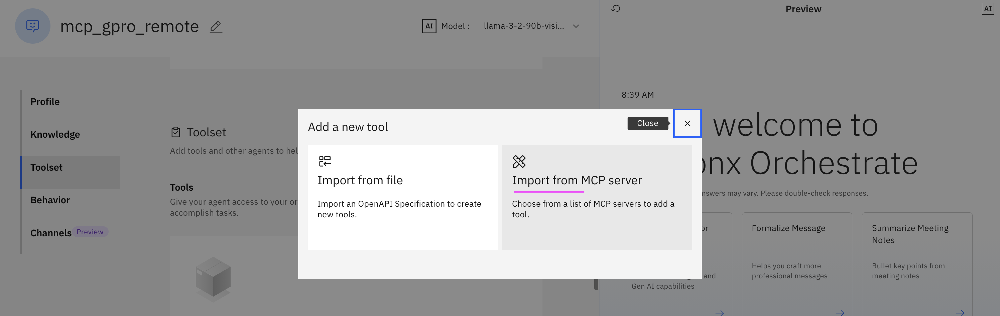
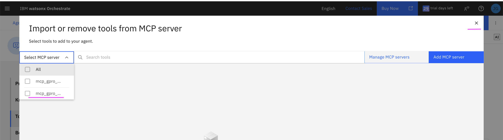
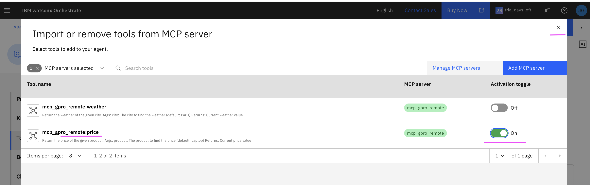
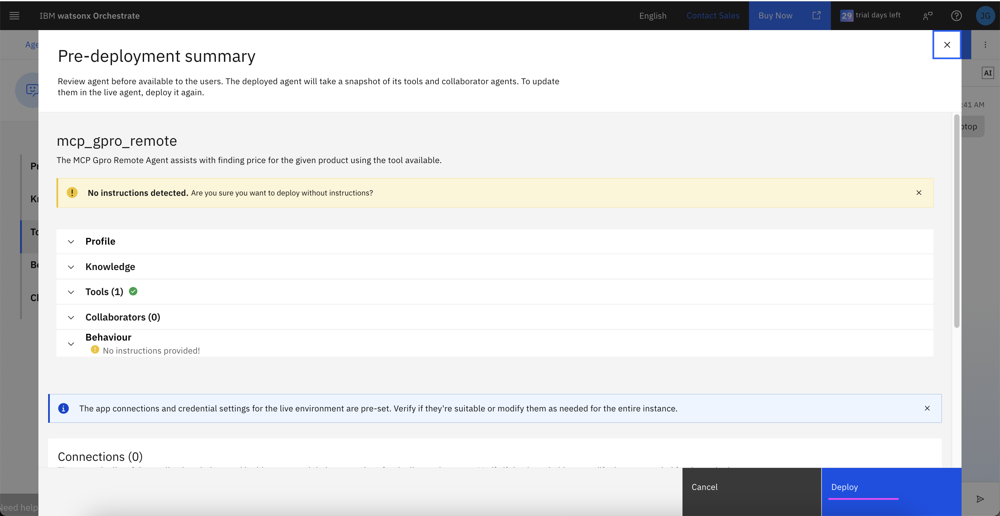
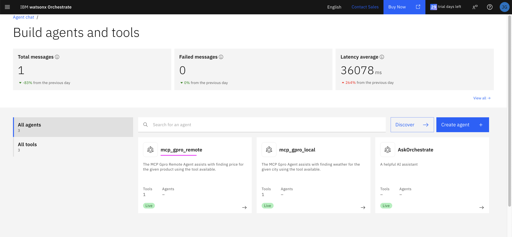

# Deploying and Accessing Remote MCP Server toolkit - Gpro app

## 1. Set up ADK

The detailed info is available [here](../001-setting-up-adk)

## 2. Importing remote MCP toolkits using ADK CLI

1. Download all files and subfolders from [here](./files)

2. A simple app is available at the folder **./mcp_gpro_remote**. Deploy this app in IBM Code Engine or in some remote system.

3. Update the APP_URL property of the **./deploy_remote.sh** file with the above url. Don't forget to end the url with **mcp**.
  ```
  APP_URL="https://mcp-gpro-app.xxxxxxxx.us-east.codeengine.appdomain.cloud/mcp"
  ```

3. Run the below command.
  ```
  ./deploy_remote.sh
  ```

  You might have got the output like this.
  ```
  [ERROR] - This functionality is only available for Local Environments
  [INFO] - Successfully imported tool kit mcp_gpro_remote
  ```

## 3. Importing remote MCP toolkits using ADK CLI

1. Goto the [files](./files) folder of this repo 

2. Run the below command.

  ```
  ./deploy_remote.sh
  ```

  You might have got the output like this.

  ```
  [ERROR] - This functionality is only available for Local Environments
  [INFO] - Successfully imported tool kit mcp_gpro_remote
  ```

## 4. Create Agent and import tool from MCP

1. Click on **Create Agent**
  

2. Enter the **Name :**

3. Enter the **Description :** `The MCP Gpro Remote Agent assists with finding price for the given product using the tool available.`

4. Click on **Create→** button
  

5. Click on **Toolset** menu

6. Click on **Add tool** button

  

7. Choose **Add from file or MCP server**
  

8. Choose **Import from MCP server**
  

10. Choose **mcp_gpro_remote** and click on **Close** icon on the top
  

11. Switch on **Activation toggle** for the selected tool **mcp_gpro_remote:price** and click on **Close** icon on the top
  

14. Click on **Deploy** button

  

15. The Agent builder screen show the **mcp_gpro_remote** agent.
  
