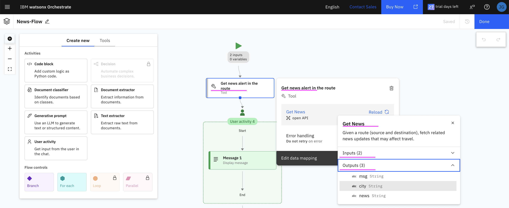

# watsonx Orchestrate Flow builder -  Finding News Alerts between cities 

The objective of this document is to explain about how to use flow in watsonx Orchestrate (wxo) to find the news alerts between two cities as like below.

   

## 1. Develop an app that returns the news alerts

### 1.1 Develop the App

1. Download the sample app from [here](./files/)

2. Run the below command to run the app locally.

  ```
  uvicorn main:app --host 0.0.0.0 --port 3001
  ```

3. Test the app using the below command

  ```
  curl --location --request GET 'http://localhost:3001/news' \
  --header 'Content-Type: application/json' \
  --data '{ "source_city": "Pune", "destination_city": "Mumbai" }'
  ```

### 1.2 Deploy the App in a Sever and get Open API

1. Create docker image and push it to registry. Don't foget to change the repo name `gandigit/wxo_news1`.

  ```
  docker build  --platform "linux/amd64"  -f Dockerfile -t gandigit/wxo_news1 .
  docker push gandigit/wxo_news1
  ```

2. Deploy the app in a server or in IBM Code Engine and get the url of the app.

3. Get the open API Json using the below url. Need to change the url accordingly.
  ```
  https://<APP_URL>/openapi.json
  ```
  It may be available like this [openapi.json](./files/openapi.json)

4. Add the below tags under the **"info":** tag. Don't forget to change the **url**.
  ```
    "servers": [
        {
            "url": "https://aaa.com",
            "description": "Local development server"
        }
    ],
  ```


## 2. Create Tool with the app in WXO

1. Create a tool **Get News** by importing the above Open API Json
   

   
   
   

## 3. Create Tool with Flow builder

Need to create a Flow Builder and use the above created Get News tool.

The Flow tool would be like this.

 

 
 

The Flow diagram would be like this.

 

The input variables would be like this.

 

The calling of Get Flow tool would be like this.

 

The user output message could be like this.

 

The branching based on the news alert could be like this.

 

The risk_percentage value can be set like this.

 

The end can be like this.

 

## 4. Create an Agent to test the Flow 

The agent with the abolve Flow can be created like this.

 
 

## 5. Result

The agent can be queried and it could return the news alerts with the risk percentage like this.

 
 
