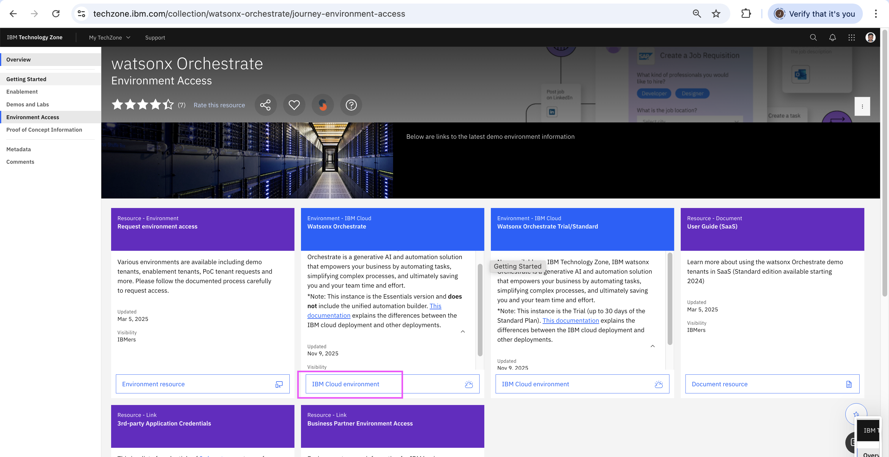
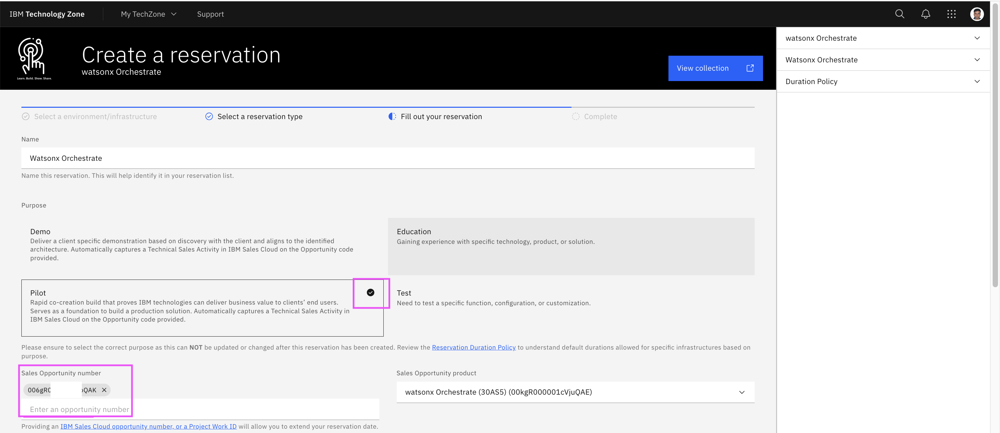
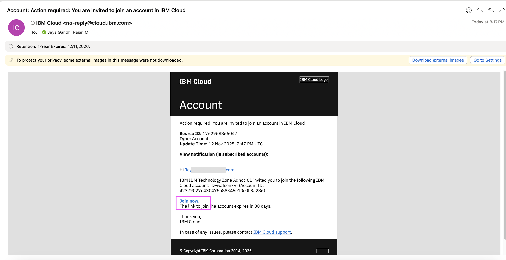
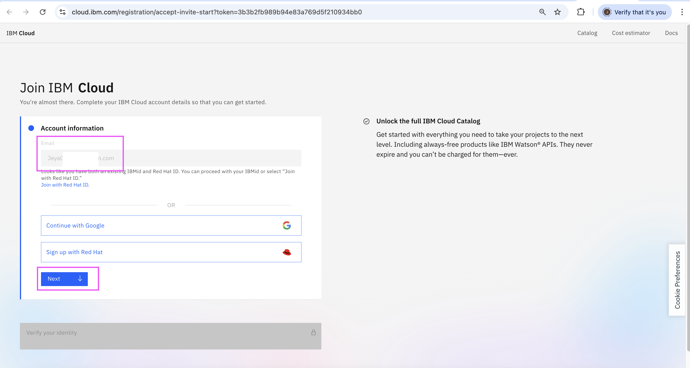
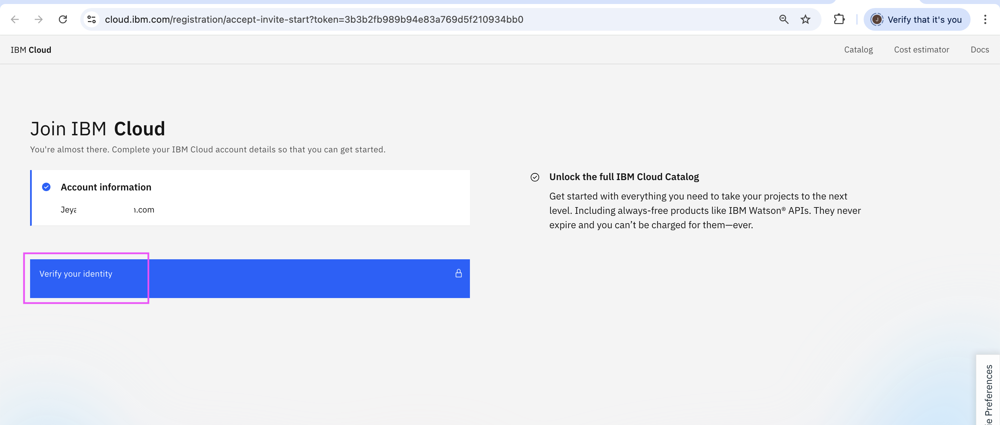
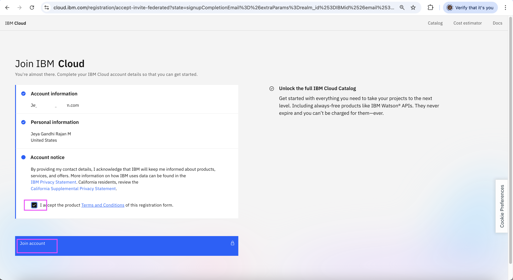
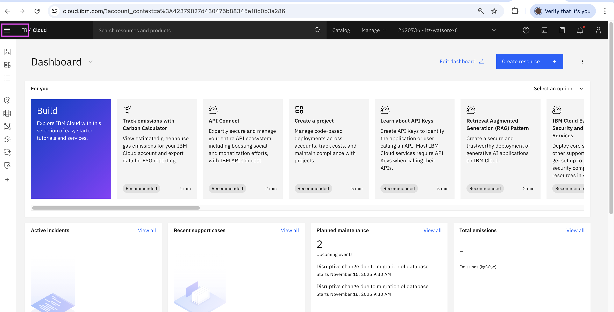
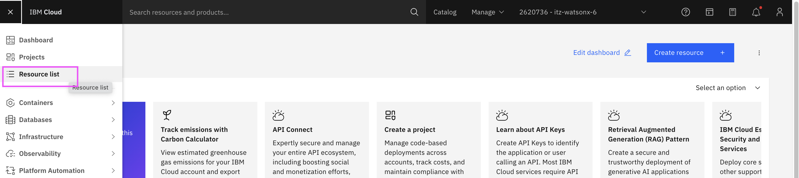
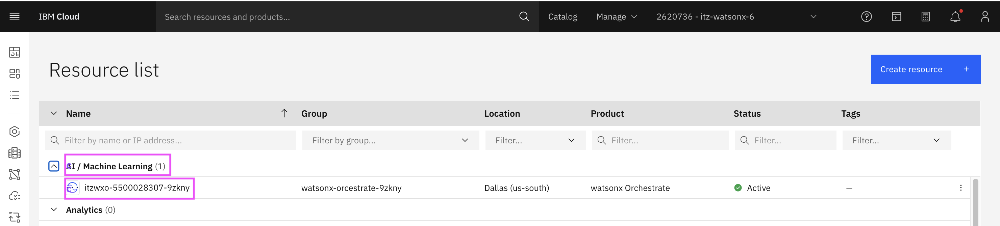
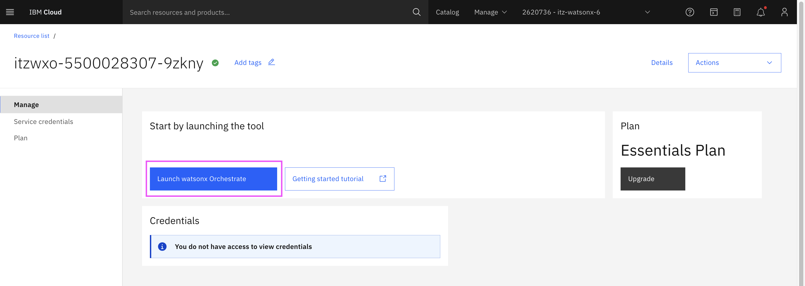

# watsonx Orchestrate - Creating TechZone instance

The objective of this document is to explain how to provision a techzone instance of watsonx Orchestrate and the steps to run the instance for the fist time.

## 1. Reserve an Instance

1. Open the techzone collection [url](https://techzone.ibm.com/collection/watsonx-orchestrate/journey-environment-access)

2. In the **Watsonx Orchestrate** tile, click on the  **IBM cloud Environment/Reserve it**

   

3. Check the **Pilot** option.

4. Enter the **Opportunity** number.

5. Choose the **Preferred Region Template region**

6. Check the **I Agree..** option

7. Click on **Submit** button

   
   

## 2. Join the Account

You should have received the mail below. 

1. Click on the **Join Now** link
   

2. Enter your **Email**. Email registered for IBM Id to be given.

3. Click on **Next** button
   

4. Click on **Verify your Identity** button or the relevant button according to your user type and follow the login process.
   

5. Check the **I accept..** option

6. Click on **Join Account** button
   

## 3. Access the watsonx Orchestrate

You should have displayed with this screen.

1. Click on the top left icon
   

2. Click on the **Resource List** menu
   

3. Click the **• AI / Machine Learning (1)** menu

4. Click the instance **itzwxo-5500028307-9zkny** menu
   

5. Click the instance **Launch watsonx Orchestrate** button
   

You have the watsonx Orchestrate home page.
   
